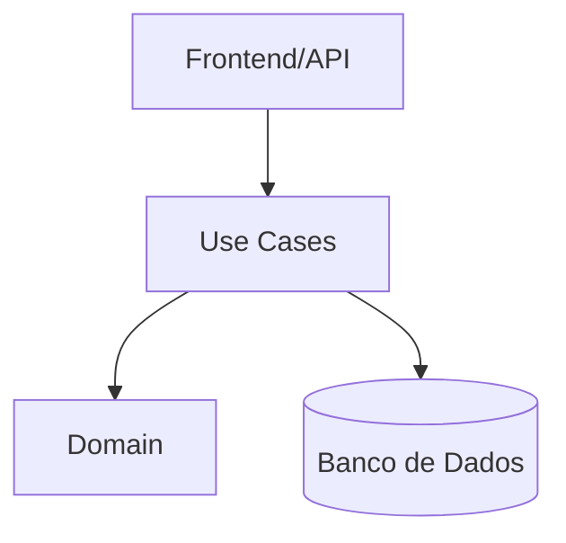

# Desenho Arquitetural e Decisões Técnicas

## Arquitetura Proposta

O QuimiPort será desenvolvido utilizando os princípios da Clean Architecture combinados com Domain Driven Design (DDD).

Essa abordagem permite separar claramente as regras de negócio dos detalhes de infraestrutura, garantindo maior manutenibilidade, testabilidade e facilidade de evolução durante as próximas fases do projeto.

Os principais objetivos da arquitetura são:

- Centralizar as regras de negócio no domínio.
- Minimizar acoplamento entre camadas.
- Facilitar testes unitários e de integração.
- Permitir evolução tecnológica sem impacto no domínio.
- Preparar a aplicação para futuras integrações externas.

---

## Arquitetura em Camadas

### Camada de Domínio (Domain)

Responsável por representar o núcleo do negócio.

Contém:

- Entidades
- Objetos de Valor
- Agregados
- Regras de Negócio
- Eventos de Domínio

Essa camada não possui dependência de frameworks, banco de dados ou interfaces externas.

---

### Camada de Aplicação (Use Cases)

Responsável pela orquestração dos casos de uso.

Contém:

- Registrar Carga
- Validar Documentação
- Solicitar Inspeção
- Bloquear Carga
- Liberar Carga

Essa camada coordena as regras definidas no domínio.

---

### Camada de Infraestrutura

Responsável pela comunicação com recursos externos.

Exemplos:

- Banco de Dados
- APIs
- Serviços de Autenticação
- Logs
- Mensageria

---

### Camada de Apresentação

Responsável pela interação com os usuários.

Futuras implementações:

- Frontend Web
- Aplicativo Mobile
- APIs REST

---

## Estrutura de Pastas

```text
quimiport/

src/

├── domain/
│   ├── entities/
│   ├── value-objects/
│   ├── aggregates/
│   ├── services/
│   └── enums/

├── use-cases/
│   ├── RegistrarCarga.ts
│   ├── ValidarDocumentacao.ts
│   ├── LiberarCarga.ts
│   └── BloquearCarga.ts

├── infrastructure/
│   ├── persistence/
│   ├── api/
│   └── repositories/

├── shared/
│   ├── interfaces/
│   ├── types/
│   └── errors/

└── presentation/
```

---

## Aplicação do TypeScript

O TypeScript foi escolhido para aumentar a segurança da aplicação através de tipagem estática, reduzindo falhas em tempo de execução.

### Enums

```typescript
export enum StatusCarga {
  PENDENTE = "PENDENTE",
  EM_INSPECAO = "EM_INSPECAO",
  BLOQUEADA = "BLOQUEADA",
  LIBERADA = "LIBERADA",
  CANCELADA = "CANCELADA"
}
```

### Interfaces

```typescript
interface IProdutoQuimico {
  id: string;
  nome: string;
  classeRisco: string;
  ativo: boolean;
}
```

### Generics

```typescript
interface IRepository<T> {
    findById(id: string): Promise<T | null>;
    save(entity: T): Promise<void>;
}
```

### Classes

```typescript
class Quantidade {
    constructor(private valor: number) {
        if(valor <= 0){
            throw new Error("Quantidade inválida");
        }
    }
}
```

### Async/Await

Será utilizado para:

- Operações de banco de dados;
- Integrações externas;
- Processos assíncronos futuros.

### Tratamento de Erros

As exceções de negócio serão tratadas através de erros especializados.

Exemplo:

```typescript
class DomainError extends Error {}
```

---

## Diagrama de Arquitetura



---

## ADRs (Architecture Decision Records)

### ADR-01: Utilização de Domain Driven Design

Objetivo:

Centralizar a complexidade do negócio portuário em uma modelagem consistente.

Benefícios:

- Melhor comunicação com especialistas do domínio.
- Regras centralizadas.
- Escalabilidade da modelagem.

---

### ADR-02: Utilização de TypeScript

Objetivo:

Adicionar tipagem estática sobre JavaScript.

Benefícios:

- Menos erros em produção.
- Melhor legibilidade.
- Melhor experiência de desenvolvimento.

---

### ADR-03: Utilização de Clean Architecture

Objetivo:

Separação clara das responsabilidades.

Benefícios:

- Menor acoplamento.
- Facilidade de testes.
- Facilidade de manutenção.

---

## Evolução Tecnológica

### Backend

- Node.js
- Fastify ou Express

### Frontend

- React
- TypeScript

### Mobile

- React Native

### Banco de Dados

- PostgreSQL

---

## Evolução para Microsserviços

Em futuras fases, os seguintes domínios poderão ser separados em microsserviços independentes:

- Gestão de Cargas
- Gestão Documental
- Gestão de Inspeções
- Gestão de Armazenamento
