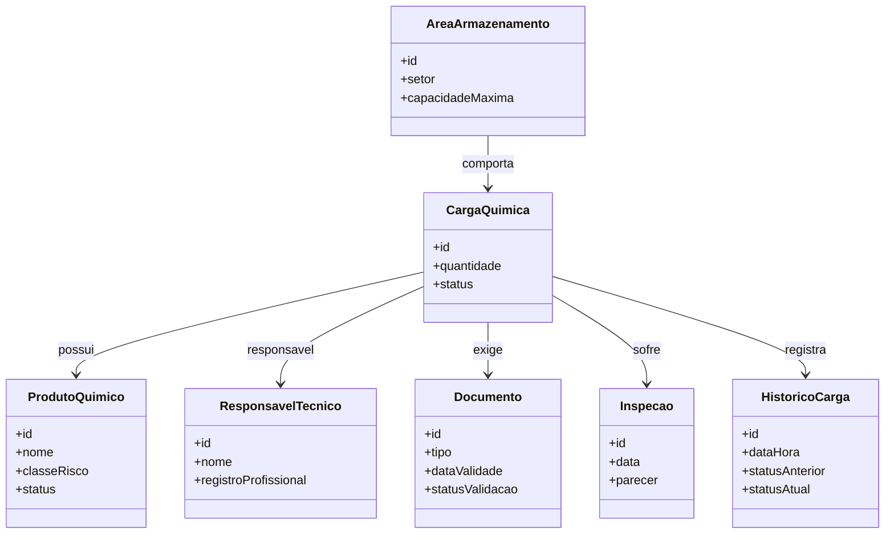

# Modelagem do Domínio e Regras de Negócio (DDD)

## Linguagem Ubíqua

### Produto Químico

Substância catalogada que possui identificação e classe de perigo associada.

### Carga Química

Lote físico de produto químico registrado para movimentação.

### Classe de Risco

Classificação regulamentar de periculosidade.

### Responsável Técnico

Profissional habilitado responsável pela validação técnica.

### Documento da Carga

Documento obrigatório para movimentação.

### Inspeção

Processo de vistoria da carga.

### Área de Armazenamento

Espaço físico destinado à acomodação da carga.

### Histórico da Carga

Registro cronológico das alterações ocorridas durante o ciclo de vida da carga.

### Liberação

Autorização operacional para movimentação.

### Bloqueio

Impedimento operacional da carga.

---

## Entidades

### Produto Químico

Atributos:

- ID
- Nome
- Classe de Risco
- Status

---

### Carga Química

Atributos:

- ID
- Produto Químico
- Quantidade
- Status
- Responsável Técnico

---

### Documento da Carga

Atributos:

- ID
- Tipo
- Data de Validade
- Status de Validação

---

### Responsável Técnico

Atributos:

- ID
- Nome
- Registro Profissional

---

### Inspeção

Atributos:

- ID
- Data
- Parecer
- Observações

---

### Área de Armazenamento

Atributos:

- ID
- Setor
- Capacidade Máxima
- Classe Permitida

---

### Histórico da Carga

Atributos:

- ID
- Data/Hora
- Usuário Responsável
- Status Anterior
- Status Atual
- Observação

Responsabilidade:

Registrar todas as alterações efetuadas na carga para fins de auditoria, rastreabilidade e conformidade operacional.

---

## Objetos de Valor

### Quantidade

Representa o volume movimentado.

Regra:

- Deve ser maior que zero.

---

### Classificação de Risco

Representa o enquadramento regulatório da substância.

---

## Agregado Principal

### Carga Química

Responsável por manter a consistência entre:

- Produto Químico
- Documentação
- Responsável Técnico
- Inspeção
- Histórico
- Status

Motivação:

A Carga Química é a principal entidade operacional do sistema. Todas as regras relacionadas à movimentação, bloqueio, liberação, documentação e auditoria são centralizadas nela, garantindo integridade transacional e consistência do domínio.

---

## Regras de Negócio

1. Toda carga deve possuir produto associado.
2. Produtos inativos não podem ser utilizados.
3. Toda carga deve possuir responsável técnico.
4. Toda carga deve possuir classificação de risco.
5. Quantidade deve ser maior que zero.
6. Não permitir liberação sem documentação válida.
7. Não permitir liberação sem inspeção aprovada.
8. Cargas bloqueadas não podem ser movimentadas.
9. Cargas canceladas não podem ser liberadas.
10. Toda alteração de status deve ser registrada em histórico.
11. Áreas de armazenamento devem ser compatíveis com a classe de risco da carga.
12. Documentos vencidos invalidam automaticamente a liberação da carga.

---

## Diagrama de Domínio



---

## Fluxo de Status da Carga

```mermaid
stateDiagram-v2

[*] --> Pendente : Registro da Carga

Pendente --> EmInspecao : Solicitar Inspecao

EmInspecao --> Liberada : Documentos e Inspecao Validos

EmInspecao --> Bloqueada : Inconformidade Detectada

Bloqueada --> EmInspecao : Correcao de Pendencias

Pendente --> Cancelada : Cancelamento Solicitado

Liberada --> [*]

Cancelada --> [*]
