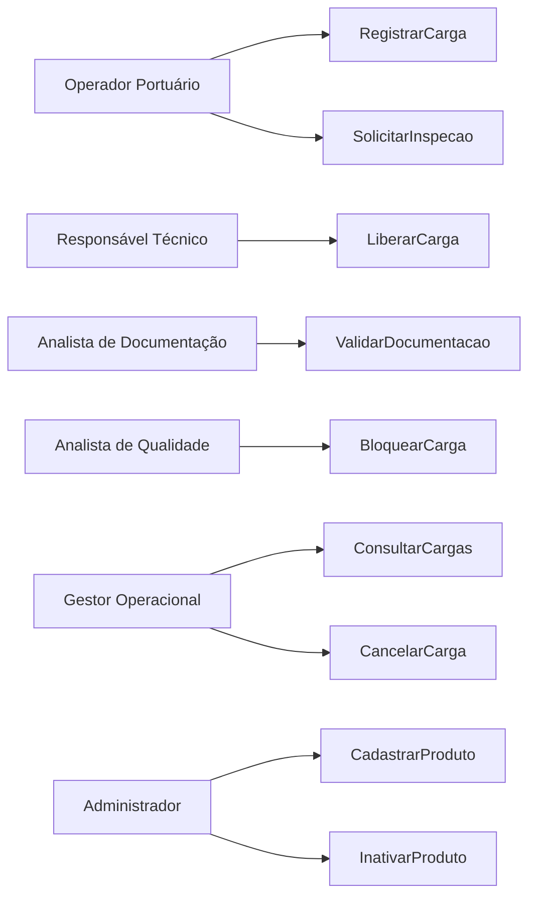

# Plano de Qualidade de Software

## Objetivo

Garantir que o QuimiPort atenda aos requisitos funcionais, não funcionais e regulatórios do domínio de cargas químicas portuárias.

O plano de qualidade busca minimizar falhas operacionais e garantir a segurança dos processos críticos do sistema.

---

## Regras de Negócio Críticas

As seguintes regras possuem maior impacto operacional e deverão receber maior atenção durante os testes:

1. Produto deve estar ativo.
2. Carga deve possuir responsável técnico.
3. Quantidade deve ser maior que zero.
4. Documentação obrigatória deve estar válida.
5. Inspeção deve estar aprovada.
6. Carga bloqueada não pode ser movimentada.
7. Carga cancelada não pode ser liberada.
8. Toda alteração deve ser registrada em histórico.

---

## Estratégia de Testes

### Testes Unitários

Objetivo:

Validar individualmente as regras de negócio.

Exemplos:

- Quantidade maior que zero.
- Produto ativo.
- Validação documental.

---

### Testes de Integração

Objetivo:

Validar a comunicação entre componentes.

Exemplos:

- Casos de uso e repositórios.
- Persistência em banco.
- Integrações externas.

---

### Testes de Fluxo

Objetivo:

Garantir o funcionamento completo dos principais processos.

Exemplos:

- Cadastro → Validação → Inspeção → Liberação
- Cadastro → Bloqueio
- Cadastro → Cancelamento

---

### Testes de Regressão

Objetivo:

Garantir que alterações futuras não afetem funcionalidades já aprovadas.

---

## Cenários de Teste

### Cenário 1

Entrada:

Produto sem nome.

Resultado Esperado:

Sistema rejeita o cadastro.

---

### Cenário 2

Entrada:

Produto sem classe de risco.

Resultado Esperado:

Sistema rejeita o cadastro.

---

### Cenário 3

Entrada:

Carga associada a produto inativo.

Resultado Esperado:

Operação bloqueada.

---

### Cenário 4

Entrada:

Quantidade igual ou menor que zero.

Resultado Esperado:

Erro de domínio.

---

### Cenário 5

Entrada:

Carga sem documentação válida.

Resultado Esperado:

Liberação bloqueada.

---

### Cenário 6

Entrada:

Movimentação de carga bloqueada.

Resultado Esperado:

Operação negada.

---

### Cenário 7

Entrada:

Carga aprovada em toda documentação e inspeção.

Resultado Esperado:

Carga liberada.

---

### Cenário 8

Entrada:

Transição inválida de status.

Resultado Esperado:

Erro de validação.

---

## Organização dos Dados de Teste

Serão utilizados:

### Mock Objects

- Produtos simulados
- Cargas simuladas
- Responsáveis técnicos simulados

### Dados Fake

Gerados localmente para testes automatizados.

### Ambientes

- Desenvolvimento
- Homologação
- Produção

---

## Métricas de Qualidade

Indicadores monitorados:

- Cobertura de testes.
- Taxa de falhas.
- Quantidade de bugs críticos.
- Tempo médio de correção.
- Taxa de aprovação dos casos de uso.

---

## Diagrama de Casos de Uso

---

## Roadmap do Projeto

### Fase 1

Modelagem do domínio, arquitetura e qualidade.

### Fase 2

Desenvolvimento da API Backend utilizando Node.js.

### Fase 3

Implementação da persistência utilizando PostgreSQL.

### Fase 4

Desenvolvimento da interface web utilizando React.

### Fase 5

Desenvolvimento do aplicativo mobile utilizando React Native.

### Fase 6

Implementação de microsserviços e integrações externas.
